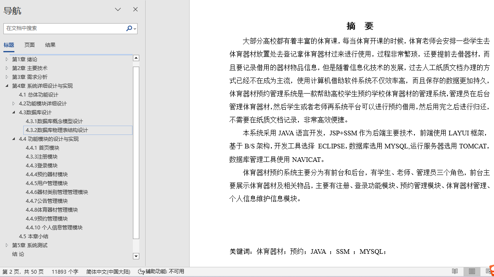
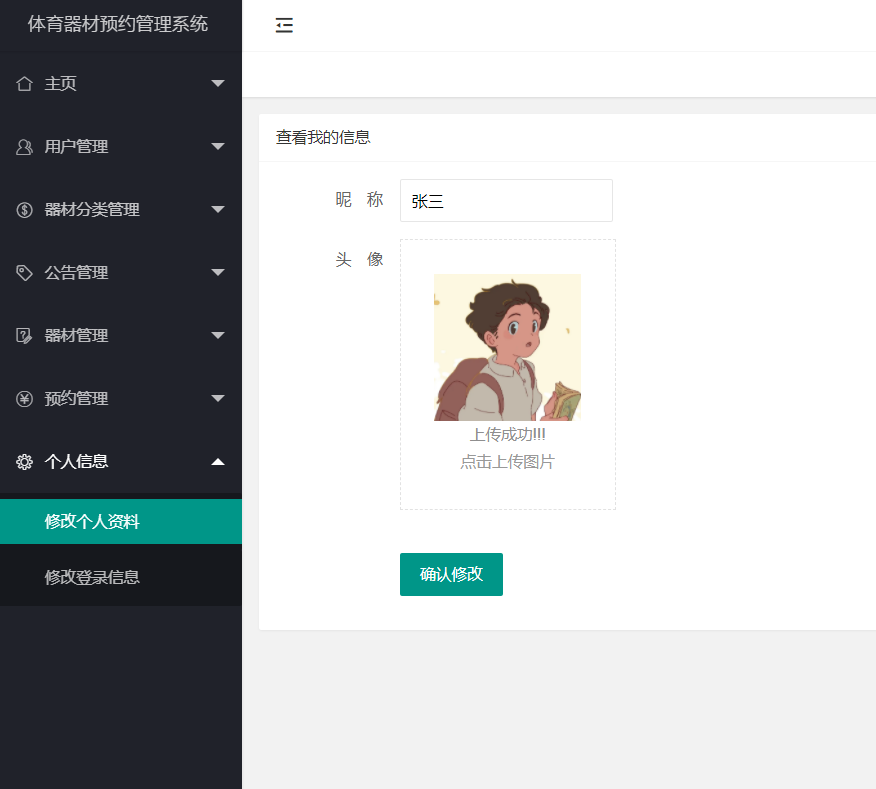
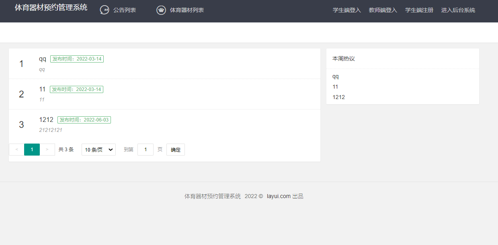
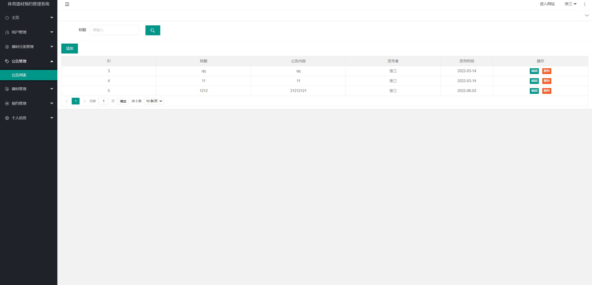
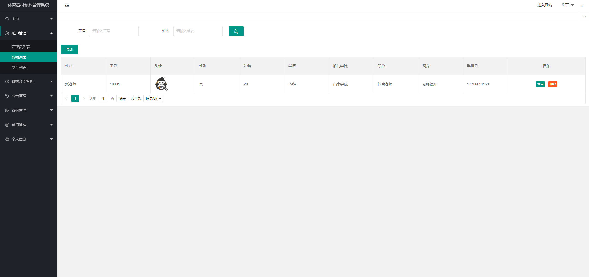
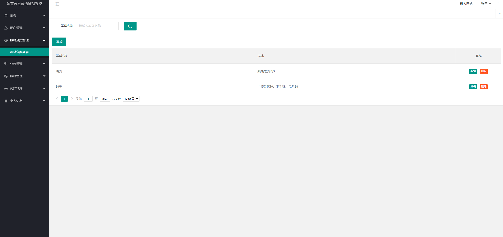
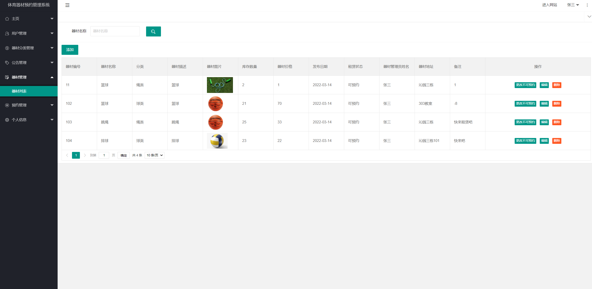
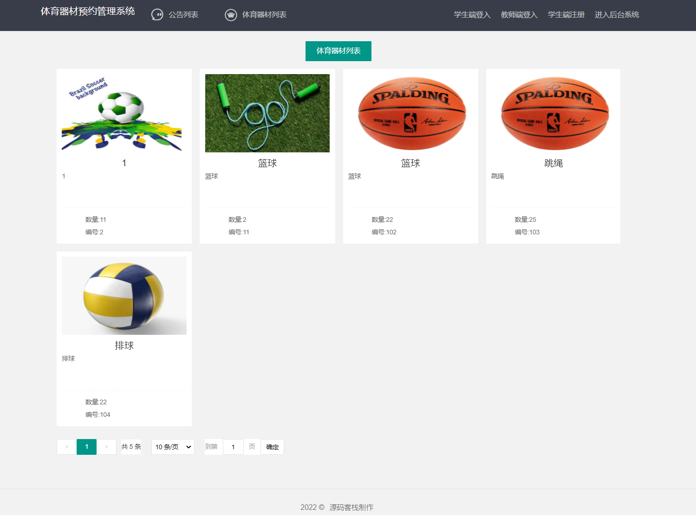
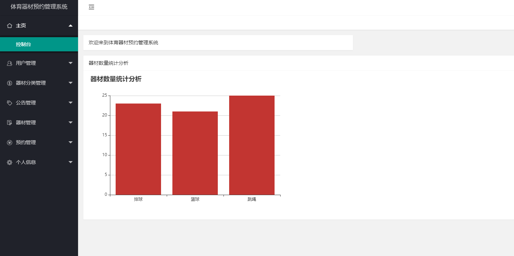
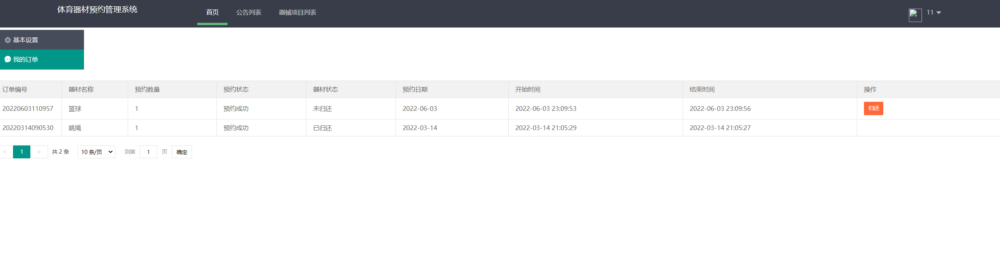

## 基于SSM框架实现的体育器材预约系统(程序+报告)

###  获取sql数据库文件: 从戎源码网 (https://armycodes.com/) QQ: 386869957 QQ群: 377586148
###  所有系统地址: (https://github.com/YuLin-Coder/AllProjectCatalog) 
###  所有项目以及源代码本人均调试运行无问题 可支持远程安装部署调试、定制修改、代码讲解

## 项目介绍
基于SSM框架实现的体育器材预约系统，包含两种角色：管理员、用户,系统分为前台和后台两大模块，主要功能如下。

学生端主要功能有注册、登录、个人信息管理、查看我的预约信息、归还器材等功能

【老师】端需要实现的主要功能有登录、归还器材、个人信息管理、我的预约信息。

【管理员】端主要功能有登录、用户管理、体育器材类别管理、器材管理、预约管理、数据统计、以及公告管理、个人信息管理等功能。

## 项目技术
- 编程语言：Java
- 数据库：MySQL
- 前端技术：JSP、HTML、Jquery、Layui、ECharts
- 后端技术：Spring、SpringMVC、MyBatis

## 运行环境
- JDK版本：JDK1.8及以上
- 开发工具：IDEA、Ecplise、Myecplise都可以
- 数据库: MySQL5.7及以上
- Maven：maven3.0及以上

## 运行截图

